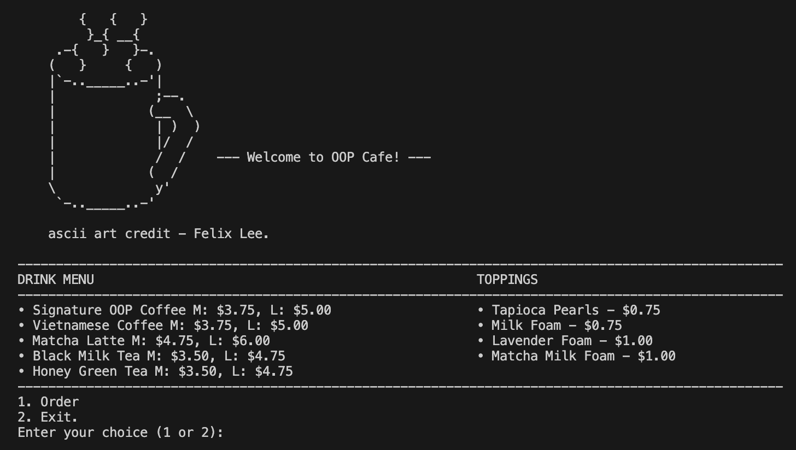
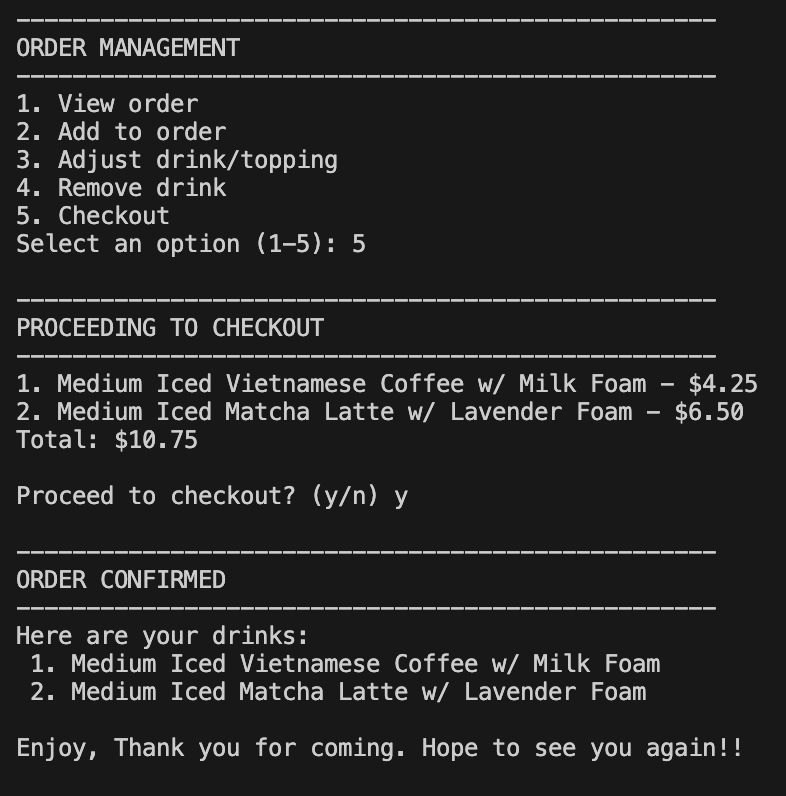

# OOP Cafe

A simple, object-oriented Python command-line cafe program.  
Users can select a drink, size, temperature, and toppings, then view their order and checkout.


## Features
- Display menu with available drinks and prices
- Create and customize drinks (size, temperature, toppings)
- Add multiple drinks to an order
- Calculate total price at checkout
- Start a new order session without restarting the program

## Object-Oriented Design
- **Key Concepts** Encapsulation, Inheritance, Polymorphism, and Abstraction
- **Drink** class: Stores drink details and calculates total price
- **Order** class: Manages a list of drinks and handles checkout
- **Menu** module: Stores available drinks and toppings



## How to Run
1. Clone this repository:
   ```bash
   git clone https://github.com/dvaidwho/OOP-Cafe.git
   cd OOP-Cafe

2. Run the program
    ```bash
    python main.py
